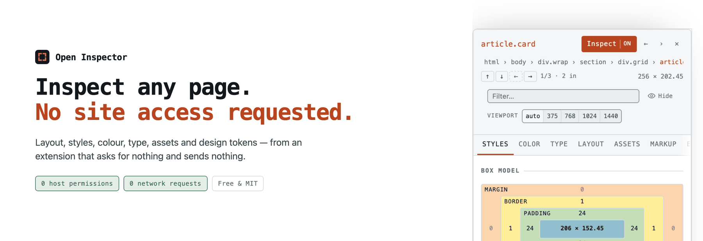
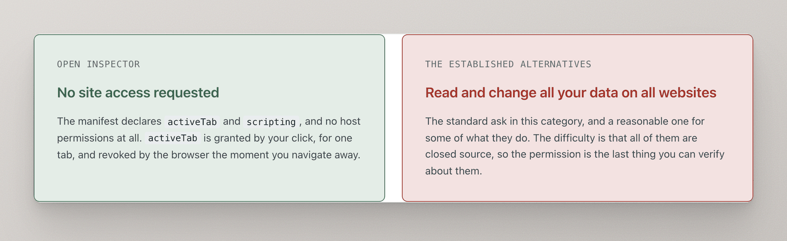
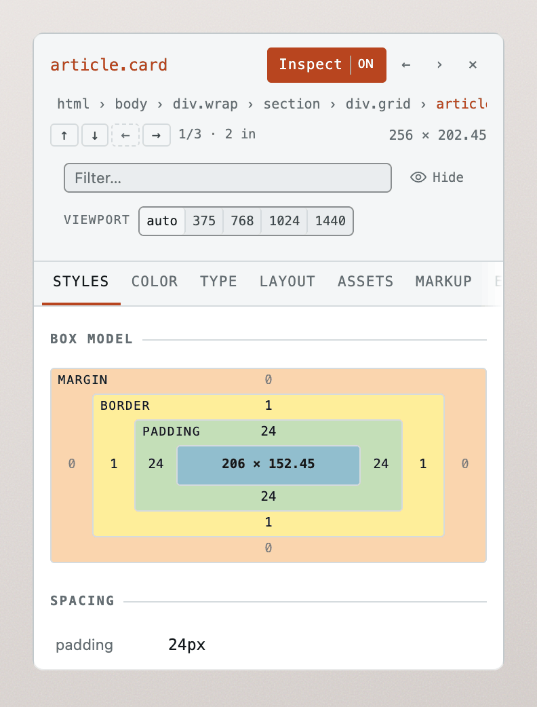
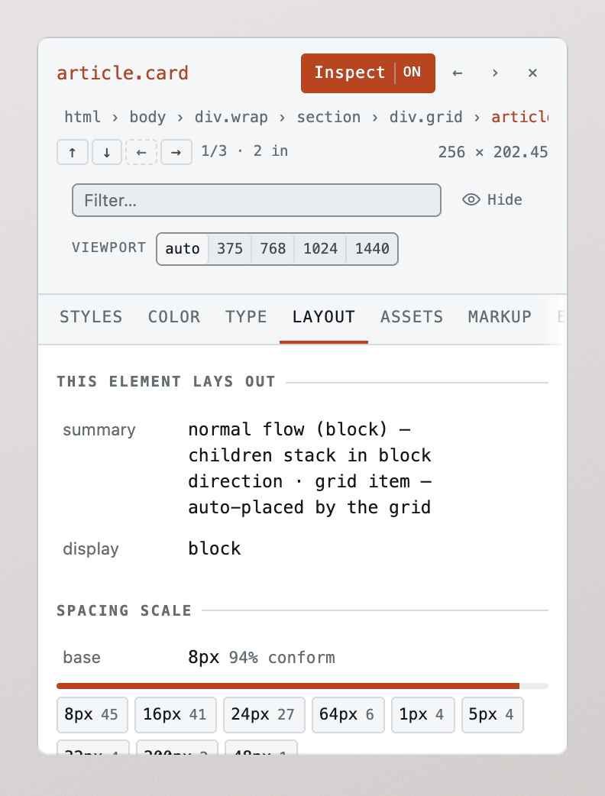
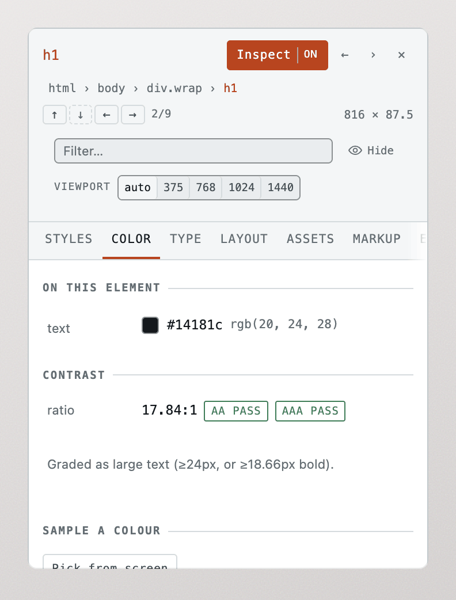
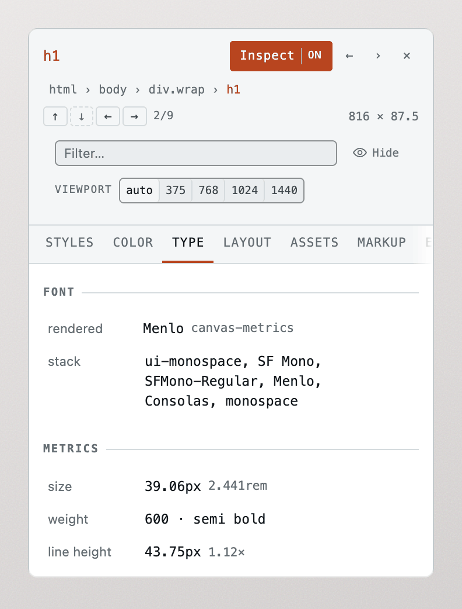

<div align="center">

<picture>
  <source media="(prefers-color-scheme: dark)" srcset="docs/media/banner-dark.png">
  
</picture>

<br>

**Inspect layout, styles and design tokens on any page — from an extension that asks for no access to your data.**

[](https://chromewebstore.google.com/detail/open-inspector/apiiaenebelbejcjpmbcecikmaahpffd)
[](https://chromewebstore.google.com/detail/open-inspector/apiiaenebelbejcjpmbcecikmaahpffd)
[](#do-not-take-our-word-for-it)
[](#do-not-take-our-word-for-it)
[](LICENSE)

**[Add to Chrome](https://chromewebstore.google.com/detail/open-inspector/apiiaenebelbejcjpmbcecikmaahpffd)** · [Website](https://open-inspector-site.pattest.workers.dev) · [Privacy](https://open-inspector-site.pattest.workers.dev/privacy)

</div>

---

## Why this exists

Every other inspector in this category asks to **read and change all your data on all websites**. That covers your staging environments, your internal dashboards, and anything you happen to be logged into. All three of the established tools are closed source, so the permission is the last thing you can verify about them.

This one asks for nothing. Chrome's own install screen will tell you the same thing.

<picture>
  <source media="(prefers-color-scheme: dark)" srcset="docs/media/permissions-dark.png">
  
</picture>

The manifest declares `activeTab` and `scripting`, and no `host_permissions` key exists. `activeTab` is granted by *your* click, for one tab, and revoked by the browser the moment you navigate away.

## What it shows you

Hover anything, or click to hold it. Arrow keys walk the tree — <kbd>↑</kbd> parent, <kbd>↓</kbd> first child, <kbd>←</kbd><kbd>→</kbd> siblings — which is the only way to reach a wrapper that has no padding of its own and is therefore entirely covered by its children.

<table>
<tr>
<td width="50%" valign="top">

**Styles** — the box model, the spacing, and the rules that actually matched, with the declarations that lost the cascade struck through. Values are editable.

<picture>
  <source media="(prefers-color-scheme: dark)" srcset="docs/media/panel-styles-dark.png">
  
</picture>

</td>
<td width="50%" valign="top">

**Layout** — how the element lays out its children, how its parent places it, and the spacing scale the page genuinely follows, with outliers named. Nothing else in this category reports this.

<picture>
  <source media="(prefers-color-scheme: dark)" srcset="docs/media/panel-layout-dark.png">
  
</picture>

</td>
</tr>
<tr>
<td width="50%" valign="top">

**Color** — live WCAG AA/AAA grading with the nearest passing colour, a screen eyedropper that reads pixels the DOM cannot, and an audit that finds every failing text sample on the page and jumps to it.

<picture>
  <source media="(prefers-color-scheme: dark)" srcset="docs/media/panel-color-dark.png">
  
</picture>

</td>
<td width="50%" valign="top">

**Type** — the font that *actually rendered*, measured on a canvas rather than read off the stack, because `document.fonts.check()` returns true for fonts that are not installed.

<picture>
  <source media="(prefers-color-scheme: dark)" srcset="docs/media/panel-type-dark.png">
  
</picture>

</td>
</tr>
</table>

Plus three more panels:

| | |
| --- | --- |
| **Assets** | Images with the `srcset` candidate the browser really chose, inline SVG lifted out as standalone markup, video, webfonts, Lottie hints |
| **Markup** | The element as HTML or JSX, with hydration ids, framework attributes and script-set inline styles stripped — source to paste, not a DOM recording |
| **Export** | CSS custom properties, SCSS, Tailwind config, JSON, W3C design tokens, and a markdown handoff written for a coding assistant |

## Do not take our word for it

Every claim above is checked by something that fails the build when it stops being true.

| | | |
| --- | --- | --- |
| **0** | host permissions | No `host_permissions` key exists in the manifest. Chrome's install screen shows no site access requested. |
| **0** | network requests | No `fetch`, `XMLHttpRequest`, `WebSocket` or `sendBeacon` — scanned across source, both generated manifests and the shipped bundles on every build by [`scripts/check-zero-egress.mjs`](scripts/check-zero-egress.mjs). |
| **946** | tests | 908 unit tests, plus 38 end-to-end tests that drive the real packaged extension in a real Chromium. |
| **AA** | its own contrast | The panel grades other pages on WCAG contrast, so it is held to the same standard in both themes by [a test that measures the real cascade](tests/e2e/contrast.spec.ts). |

```bash
pnpm verify   # typecheck, lint, unit tests, and the zero-egress guard
```

## Editing, safely

Spacing and appearance in **Styles**, the metrics in **Type**, and the element's own colours in **Color** are all editable — click, type, Enter. Arrow keys step numbers (<kbd>Shift</kbd> by ten, <kbd>Alt</kbd> by a tenth).

Three properties make that safe on a page you cannot afford to break:

- **Exactly revertible.** Every edit records the element's prior *inline* value **and** its `!important` state, so reverting restores what was there — including a page's own inline styles, which a blanket `style.cssText = ''` would destroy.
- **Rejected values are reported, not swallowed.** `setProperty` silently ignores anything it cannot parse, so values are checked with `CSS.supports` *before* being written. Checking afterwards cannot work: if the element already had `color: blue` inline, a rejected write leaves `blue` in place, which is indistinguishable from success.
- **Nothing is persisted.** Closing reverts every edit and removes the `style` attribute it created, down to not leaving an empty `style=""` behind.

## Known limits

Honest failure beats a confident wrong answer, so the panel reports what it cannot see.

- **Cross-origin stylesheets cannot be read.** `.cssRules` throws when a stylesheet is served from another origin without CORS headers, and no extension permission changes that — the restriction follows the stylesheet, not the reader. Stripe serves all six of its sheets this way, so Matched Rules is empty there and *says so* rather than claiming nothing matched. DevTools works around this by refetching the CSS over the network; we will not, because that would break the zero-egress promise.
- **Canvas and WebGL** surfaces have no DOM inside them. Nothing can fix this.
- **Closed shadow roots** are undetectable by design. An empty custom element that clearly rendered something is flagged as probably hiding one, described as the heuristic it is.
- **Cross-origin iframes** are unreachable from the parent frame, for every extension.
- **The responsive preview cannot go below the operating system's minimum window width**, roughly 570px on macOS. The panel reports the width actually achieved rather than the one requested.
- **`color-mix()`, `light-dark()` and relative colour syntax** are refused rather than guessed at. `lab()`, `lch()`, `oklch()` and `oklab()` all parse.
- **No screenshots, console or network debugging.** Those are separate products.
- **No bulk asset download**, deliberately: zipping every asset would mean fetching every asset. The Assets tab offers the URL list for `curl` instead.

## Development

```bash
pnpm install
pnpm build          # production build into .output/chrome-mv3
pnpm launch         # a disposable browser with the extension already installed
```

`pnpm launch` starts the playground and opens a Chromium window with the extension loaded. Press <kbd>Alt</kbd>+<kbd>Shift</kbd>+<kbd>I</kbd>, then hover anything. <kbd>Esc</kbd> stops it.

> **Use `pnpm build`, not `pnpm dev`, before loading it manually.** WXT writes both to `.output/chrome-mv3`, but the dev manifest adds the `tabs` permission, host permissions for localhost, and a relaxed CSP so hot reload can work. Loading that would show the permission posture this project exists to avoid — `pnpm launch` refuses to start on a dev build for the same reason.

<details>
<summary><b>All commands</b></summary>

| Command | What it does |
| --- | --- |
| `pnpm launch` | Disposable browser with the extension installed |
| `pnpm dev` / `pnpm dev:firefox` | WXT dev build with hot reload |
| `pnpm build` / `pnpm build:firefox` | Production build into `.output/` |
| `pnpm zip` | Package for the store |
| `pnpm test` | Unit tests |
| `pnpm e2e` | End-to-end: the real extension in a real browser |
| `pnpm e2e:headed` | Same, with a visible window |
| `pnpm typecheck` | Project-wide typecheck |
| `pnpm check:egress` | The zero-egress guard |
| `pnpm check:size` | Bundle budgets, gzipped |
| `pnpm check:site` | The website's own contrast and image-ratio checks |
| `pnpm sweep` | Run the engine against real production sites |
| `pnpm verify` | Typecheck, lint, unit tests, egress guard |
| `pnpm gen:icons` / `gen:promo` / `gen:shots` | Regenerate icons, store promo images, screenshots |

</details>

### Layout

```
packages/core    the engine. pure TypeScript, no chrome.*, no network
packages/ui      shadow-DOM overlay and the interaction loop
apps/extension   WXT shell: manifest, background worker, injected script
apps/playground  manual test surface, and the demo page used for screenshots
apps/site        the website — static files on Cloudflare Workers
```

The engine deliberately knows nothing about browser extensions. It takes a DOM and returns data, which is what lets it be unit-tested without a browser and reused later in a CLI or a Playwright plugin.

**How the zero-permission manifest works:** the content script is declared with `registration: 'runtime'` and **no** `matches` patterns. WXT only promotes a runtime script's match patterns into `host_permissions`, so declaring none leaves the manifest free of host access. The background worker injects it via `scripting.executeScript` under `activeTab`.

### The reliability sweep

```bash
pnpm build && pnpm sweep
```

Bundles the engine standalone, injects it into a dozen real production sites, and drives every module over a spread of elements on each. It reports two kinds of finding, deliberately kept apart: **errors** (something threw — always a bug) and **suspicions** (it returned, but the answer looks wrong — no rendered font on visible text, an empty palette on a colourful page).

It has already earned its keep. The first run found that Chrome serializes computed colours as `lab()` whenever the author used a modern colour space — so on tailwindcss.com, 2,398 colour values were being rejected as unreadable and the palette came back nearly empty. That is the most popular CSS framework there is, and no unit test would have caught it.

## Contributing

The reliability harness is the best place to start. A page the inspector gets wrong is a perfectly scoped issue: add it to `tests/fixtures/` as a snapshot, assert the correct reading, and fix it. No product-design judgment required, and every fixture makes the next change safer.

## Supporting it

There is a **Buy me a coffee** link in the panel's footer, and that is the entire business model. The extension is free, all of it, forever — there is no paid tier, no licence check and no account, and there *cannot* be: a licence check is a network request, which is the one thing this project promises never to make.

## License

MIT. See [LICENSE](LICENSE).
